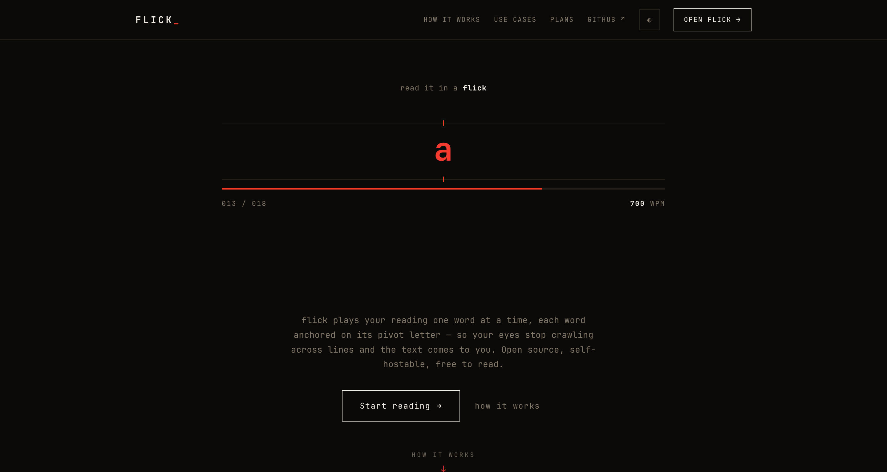

# flick-landing

[](https://github.com/one-more-refactor/flick-landing/actions/workflows/ci.yml)
[](https://github.com/one-more-refactor/flick-landing/releases/latest)
[](https://github.com/one-more-refactor/flick-landing/compare)
[](LICENSE)

The marketing site for [**flick**](https://github.com/one-more-refactor/flick) — the hosted service at **[myflick.app](https://myflick.app)**. Hosted-only: the self-hosted edition ships its own in-app guest door and never needs this.



## Stack

**[Astro](https://astro.build)** (static, zero JS by default) with interactive islands: the auto-running RSVP hero, a pinned ORP scroll scene, use-case vignettes. Motion: **GSAP** · **Lenis** · **anime.js** · **Vanta**/three.js (lazy, theme-synced, off under `prefers-reduced-motion`).

> Those libraries are why this repo is separate and **MIT**: some are not GPL-compatible, so they stay out of the AGPL app. The app's own motion is Web Animations API only.

## Brand

Design tokens ported from the app (`src/styles/tokens.css`): monospace, square corners, one `--accent`, light/dark read from `flick.mode`/`flick.theme` before first paint. CTA targets live in `src/config.ts`.

## Develop / Deploy

```sh
bun install && bun run dev    # http://localhost:4321
bun run build                 # -> dist/
podman build -t flick-landing -f deploy/Containerfile .   # nginx:alpine, rootless, behind a CF tunnel
```

Releases: bump `package.json`, tag `vX.Y.Z`, push — CI verifies the version, builds, and publishes the release.

## License

[MIT](LICENSE) — this site only. The flick app is [AGPL-3.0](https://github.com/one-more-refactor/flick/blob/master/LICENSE). Bundled libraries carry their own licenses.
